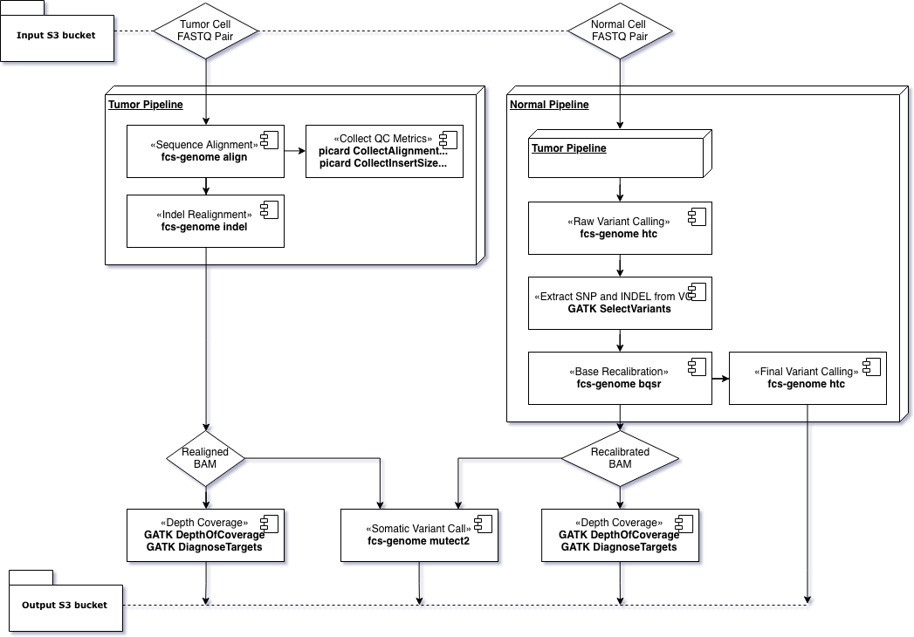

# Somatic Variant Calling Pipeline README

## Overview
In this document, we introduce the Somatic variant calling pipeline using Falcon Accelerated Genomics Pipelines based on GATK 3.8 Best Practices.
For more details:
- [Falcon Accelerated Genomics Pipelines](https://github.com/falconcomputing/falcon-genome)
- [GATK Best Practices](https://software.broadinstitute.org/gatk/best-practices/workflow?id=11146)

## Pipeline Configuration
The chart below illustrates the entire processing pipeline.

The input data to the pipeline includes the following:
- Normal sample FASTQ pairs (`${normal_sample}_1.fastq.gz` and `${normal_sample}_2.fastq.gz`)
- Tumor sample FASTQ pairs (`${tumor_sample}_1.fastq.gz` and `${tumor_sample}_2.fastq.gz`)

Output data includes the following:
- Recalibrated BAM files of the normal sample, with QC data
- Realigned BAM files of tumor sample, with QC data
- Germline variants of the Normal sample
- Somatic variants from Mutect2
- All log files with run information

### Software and Versions
1. Falcon Accelerated Genome Pipeline v1.0
1. GATK 3.8
1. Picard 1.141

## Running the Pipeline

### Preparation
1. Naming conventions
    - Sample ID: a single ID `${sample_id}` is used for both tumor and normal samples
    - Input files:
        - Normal FASTQ pairs: `${sample_id}-normal_R[1|2].fastq.gz`
        - Tumor FASTQ pairs: `${sample_id}-tumor_R[1|2].fastq.gz`
        - E.g.:
            ```
            - Pt33-normal_R1.fastq.gz
            - Pt33-normal_R2.fastq.gz
            - Pt33-tumor_R1.fastq.gz
            - Pt33-tumor_R2.fastq.gz
            ```
    - Output files: the output files for each sample will be stored to the output S3 bucket in a separate folder such as `Pt33/`, containing the following sub-folders:
        - `./mutect.vcf`: somatic variant output of Mutect2
        - `./normal/`: QC metrics and output files, e.g. `Pt33-normal_recal.bam`, `Pt33-normal_raw_variants_recal.vcf.gz`
        - `./tumor/`: QC metrics and output, e.g. `Pt33-normal_realn.bam`

1. Pipeline Setup: `cp ./globals.sh.template ./globals.sh` and modify the following lines:
    ```
    input_s3_bucket=
    output_s3_bucket=
    topic_arn=
    ref_dir=
    ```
  - `input_s3_bucket` and `output_s3_bucket`: input and output s3 bucket path
  - `topic_arn`: ARN resource name for AWS SNS topic used for sending pipeline run information
  - `ref_dir`: local directory for reference files

  The following variables can be left as default but can also be modified for specific use cases
  - `ref_genome`
  - `dbsnp`
  - `cosmic`
  - `intv`

## Run the Pipeline
The pipeline can be start with a single argument of the sample id, in a directory with abundant storage space to store the intermediate data for the entire pipeline. If the pipeline is successful, all the output data will be uploaded to output S3 bucket and other files will be cleaned up. Below is an example assuming a storage is mounted at `/local/work`.
```
> cd /local/work
> nohup $SCRIPT_DIR/falcon-run {sample_id} &
```
